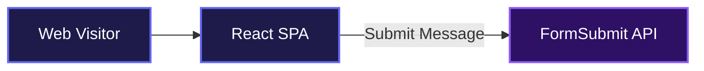
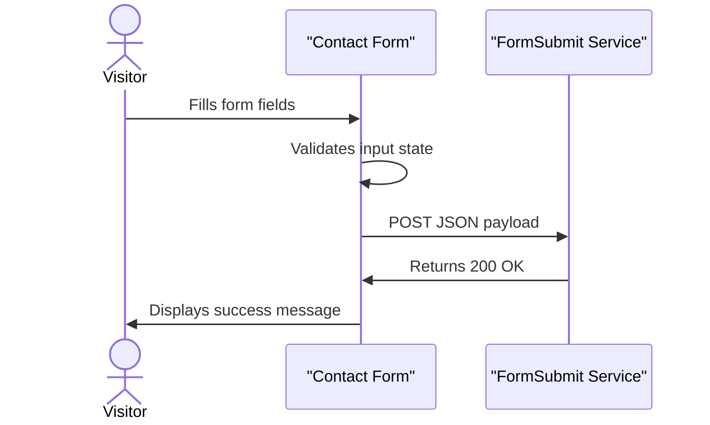

# Portfolio Kofi Obuom

This project is an interactive portfolio that helps recruiters and engineering teams explore a developer's professional background, project history, and technical capabilities. It takes standard career information and presents it through a clean, terminal-inspired interface that performs perfectly across all devices. No bloated dependencies, just straightforward design that gets right to the content.

## System Architecture



## Installation

Clone the repository and install the dependencies to get started locally.

```bash
git clone https://github.com/kofiobuomagyare/portfolio.git
cd portfolio
npm install
```

Start the development server:

```bash
npm run dev
```

## Usage

Once the development server is running, open the provided localhost URL in your browser. The application is completely standalone and does not require a local backend. 

You can interact with the theme toggle in the navigation bar to switch between light and dark modes, click through the selected projects to view external links, and use the contact form to send an actual email to the configured inbox. To customize the portfolio for your own use, replace the profile image at `public/portrait.png` and update the personal details within the respective component files.

## Features

**Terminal-Inspired Interface**
The UI presents information using developer-centric visual metaphors. Work history is displayed as a git log, while the about and project sections mimic terminal panes complete with mock shell commands.

**Contact Form Integration**
The project processes user inquiries directly from the website without requiring a custom backend server.



**Responsive Navigation**
Mobile users get a custom liquid glass bottom navigation bar that blurs the background and docks securely to the bottom of the screen.

**Dynamic Role Flipper**
The hero section features a self-adjusting text cycler that rotates through different professional titles, scaling perfectly to fit the available screen width.

## Technologies Used

* React
* Vite
* Standard CSS
* FormSubmit

## Contributing

Contributions are welcome. Feel free to open an issue or submit a pull request if you have suggestions for improvements or find any bugs.

## Author

* LinkedIn: https://linkedin.com/in/kofi-obuom-agyare-760876263
* X: https://x.com/sey_ram08

***

[](https://reactjs.org/)
[](https://vitejs.dev/)
[](https://developer.mozilla.org/en-US/docs/Web/JavaScript)

[](https://dokugen.samueltuoyo.com)